# Software Architecture Design (SAD)
## TCM — Terminal Connection Manager

**Version:** 1.0  
**Date:** 2025-05-23  
**Status:** Draft  

---

## 1. Architecture Overview

### 1.1 Architectural style

TCM theo kiến trúc **module-based trong single process** với event-driven communication giữa các modules. Không có IPC, không có daemon — một process duy nhất, loosely coupled bằng `EventBus`.

### 1.2 High-level component diagram

```mermaid
graph TB
    subgraph TCM Process
        TUI[TUI Layer\nncurses]
        CORE[Core Engine]
        PROTO[Protocol Adapters]
        LOG[Logger Module]
        MACRO[Macro Engine]
        CRED[Credential Store]
        EB[EventBus]

        TUI <-->|events| EB
        CORE <-->|events| EB
        PROTO -->|data| EB
        LOG <--|data events| EB
        MACRO <-->|trigger/send| EB
        CRED -->|secrets| CORE
    end

    subgraph OS
        PTY[PTY / openpty]
        EPOLL[epoll]
        FS[File System]
    end

    subgraph Remote Devices
        SSH_SRV[SSH Server]
        SERIAL[/dev/ttyUSBx]
        TELNET[Telnet Server]
    end

    PROTO -->|libssh2| SSH_SRV
    PROTO -->|termios| SERIAL
    PROTO -->|BSD socket| TELNET
    CORE --> PTY
    CORE --> EPOLL
    LOG --> FS
    CRED --> FS
```

### 1.3 Layer diagram

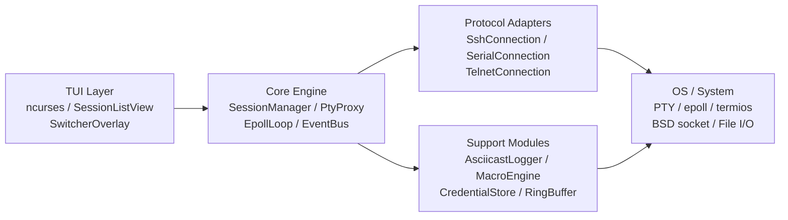

---

## 2. Module Design

### 2.1 Class diagram — Core

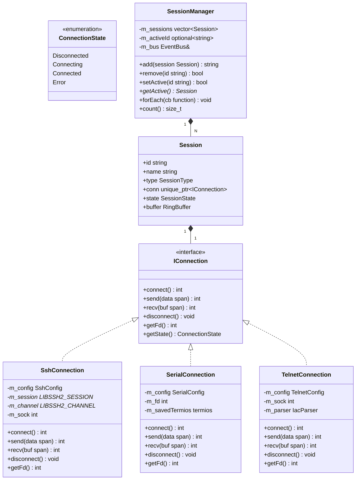

### 2.2 Class diagram — PTY Proxy & Event Loop

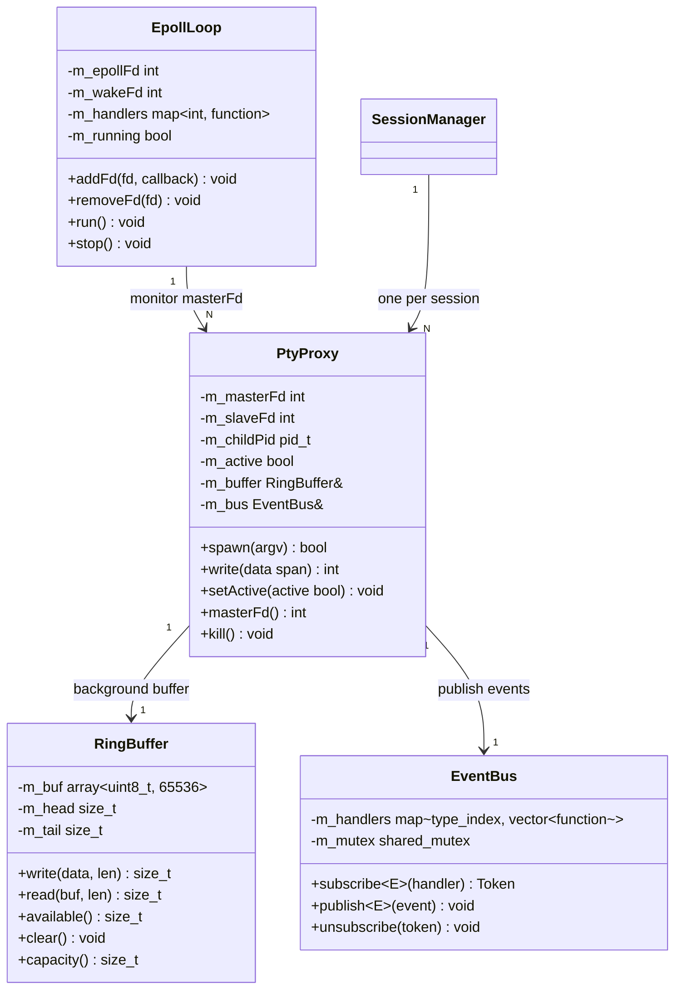

### 2.3 Class diagram — TUI

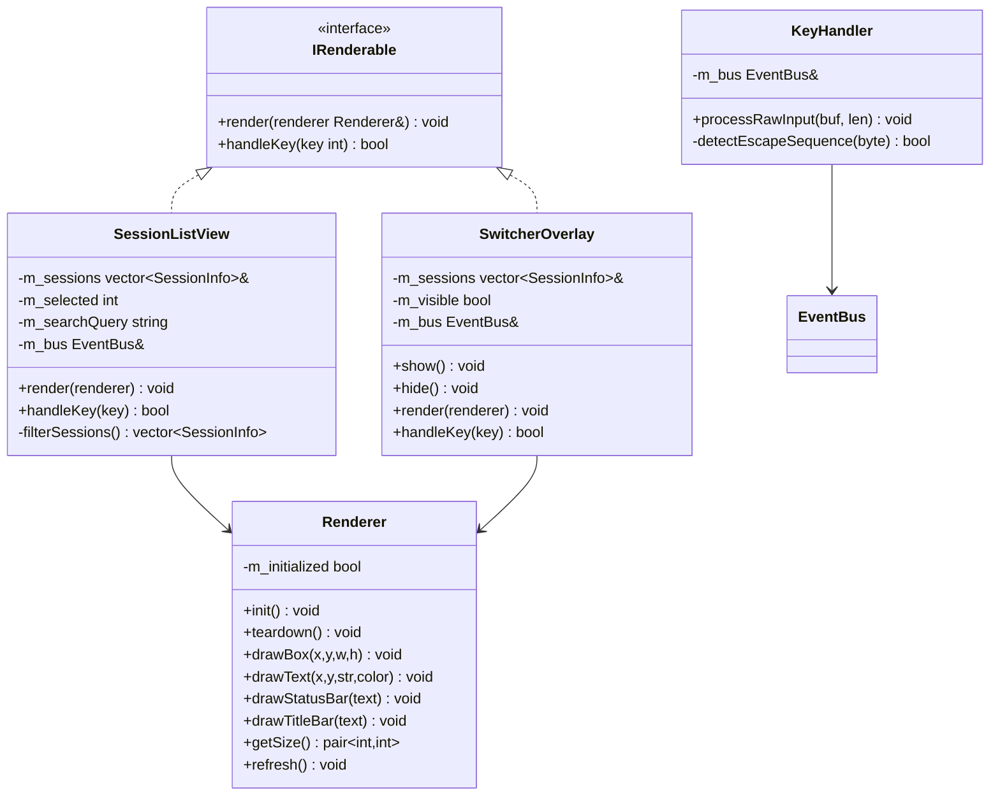

### 2.4 Class diagram — Logger & Macro

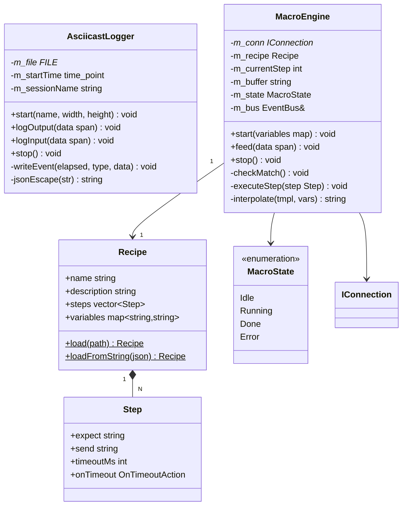

---

## 3. Sequence Diagrams

### 3.1 Connect session flow

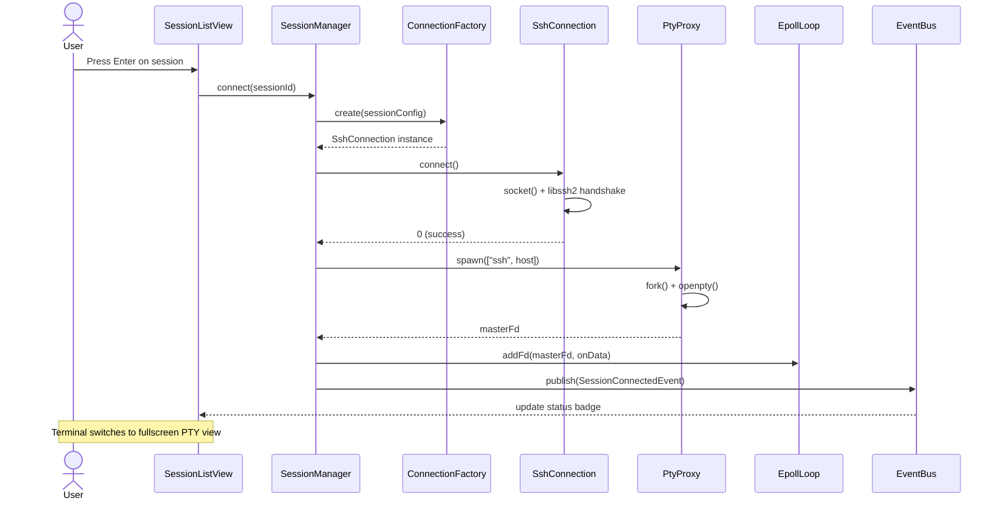

### 3.2 Session switch flow (Ctrl+])

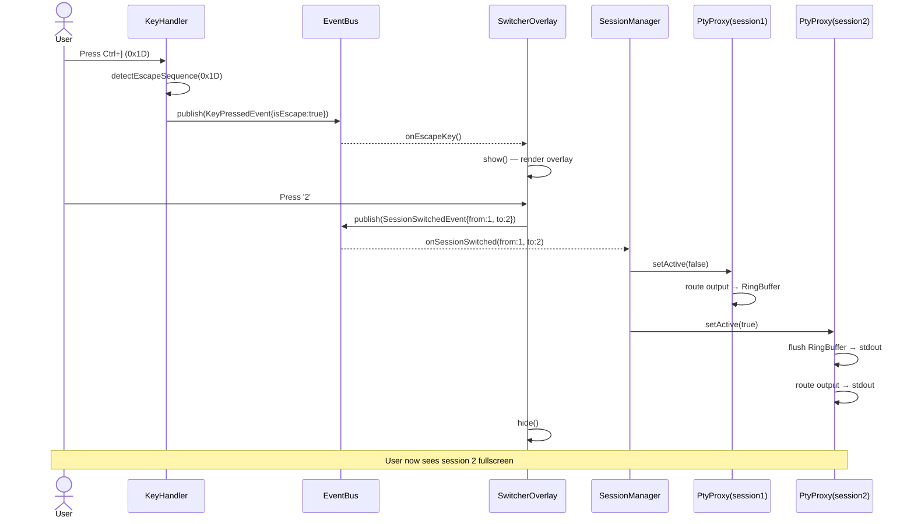

### 3.3 Macro execution flow

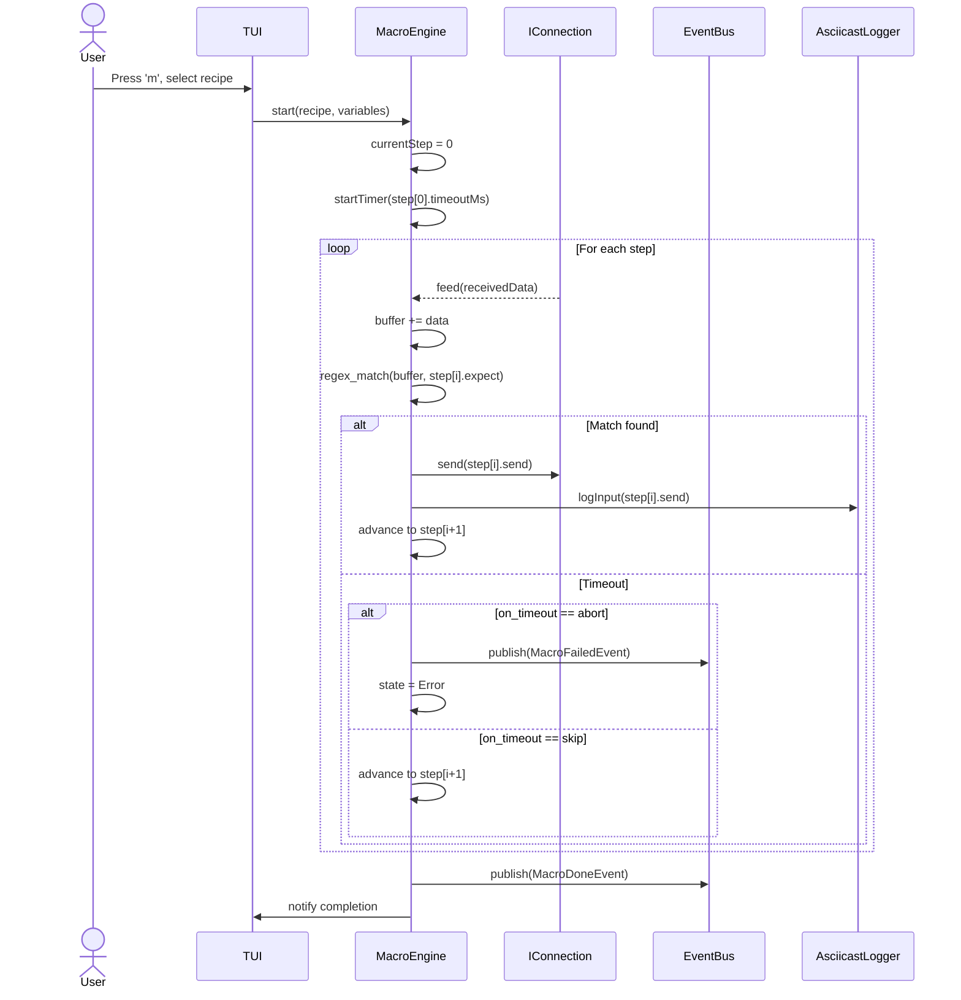

### 3.4 Session logging flow

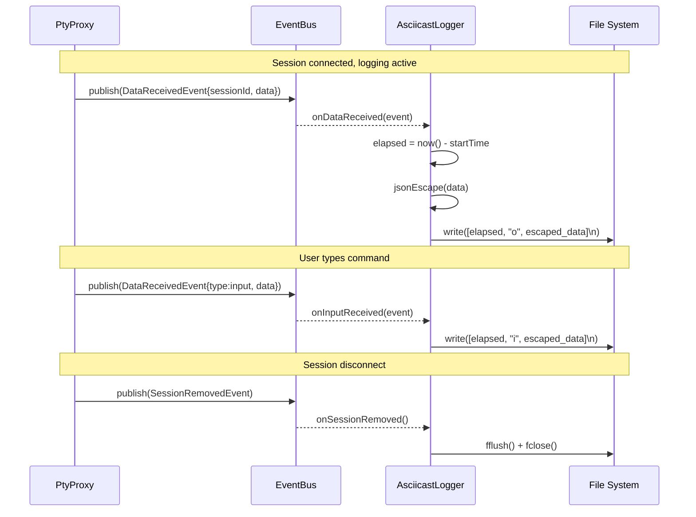

---

## 4. Data Flow

### 4.1 Keyboard input flow

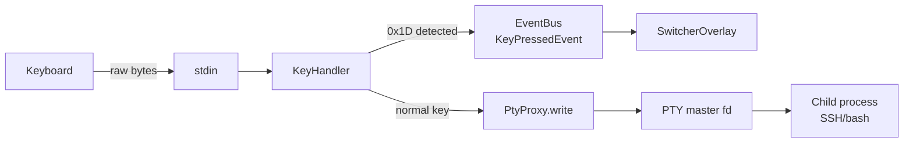

### 4.2 Output data flow (active session)

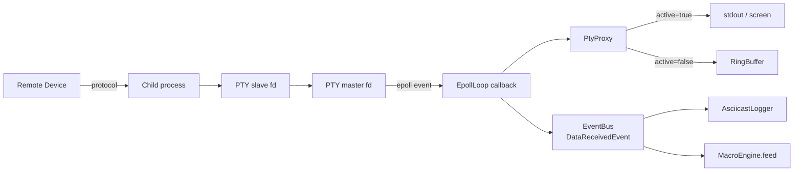

### 4.3 Session data model

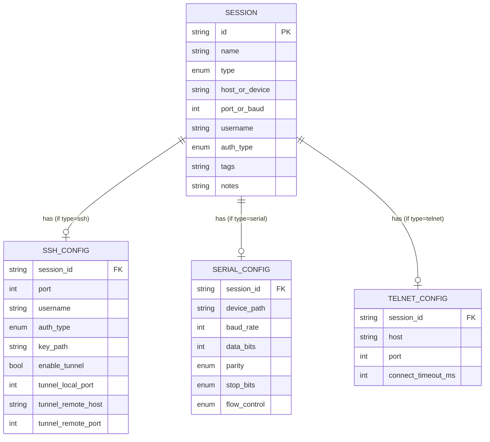

---

## 5. Concurrency Design

### 5.1 Thread model

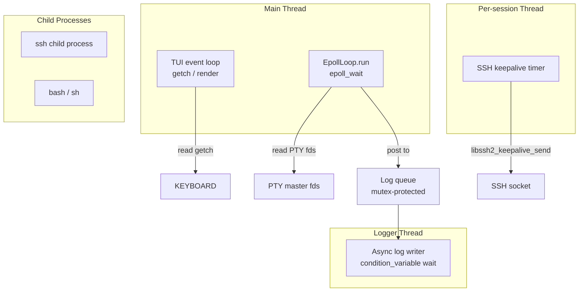

**Quy tắc:**
- Main thread: TUI rendering + epoll loop (single-threaded, không cần lock)
- Logger thread: async write từ queue, không block main thread
- Keepalive thread: 1 per SSH session, lightweight timer
- EventBus publish/subscribe: thread-safe với `shared_mutex`
- RingBuffer: single-producer (epoll thread) / single-consumer (main thread) → dùng atomic

### 5.2 Synchronization points

| Resource | Protection | Notes |
|---|---|---|
| `SessionManager::m_sessions` | `std::mutex` | Add/remove từ TUI thread |
| `EventBus::m_handlers` | `std::shared_mutex` | Read-heavy (publish) |
| `RingBuffer` | `std::atomic` head/tail | SPSC lock-free |
| Log queue | `std::mutex` + `condition_variable` | Async writer |
| `SwitcherOverlay::m_visible` | Main thread only | No lock needed |

---

## 6. Error Handling Strategy

### 6.1 Error taxonomy

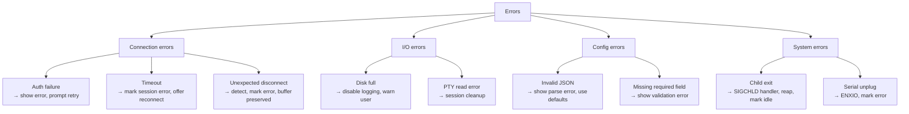

### 6.2 Error propagation

- **Connection errors:** Adapter trả về error code → `SessionManager` nhận, publish `SessionErrorEvent` → TUI hiện badge `✗`
- **Fatal system errors:** Log to stderr + syslog, graceful shutdown
- **Non-fatal errors:** Log + notify user qua status bar message (tự clear sau 5 giây)

---

## 7. Configuration Schema

### 7.1 Main config: `~/.config/tcm/config.json`

```json
{
  "version": 1,
  "log_dir": "~/.local/share/tcm/logs",
  "max_log_size_mb": 50,
  "ssh_known_hosts": "~/.ssh/known_hosts",
  "ring_buffer_size_kb": 64,
  "keepalive_interval_s": 30,
  "theme": "default"
}
```

### 7.2 Sessions: `~/.config/tcm/sessions.json`

Xem SRS Section 5.2 cho schema đầy đủ.

---

## 8. Build Architecture

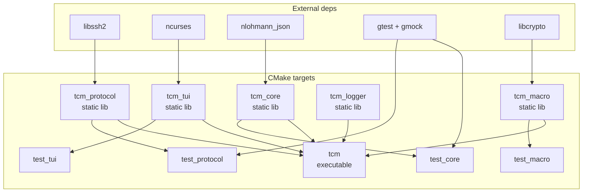

### 8.1 Build commands

```bash
# Debug build với sanitizers
cmake -B build -DCMAKE_BUILD_TYPE=Debug -DTCM_SANITIZE=ON
cmake --build build -j$(nproc)
ctest --test-dir build --output-on-failure

# Release build
cmake -B build-release -DCMAKE_BUILD_TYPE=Release
cmake --build build-release -j$(nproc)

# Static binary
cmake -B build-static -DCMAKE_BUILD_TYPE=Release -DTCM_STATIC=ON
cmake --build build-static -j$(nproc)
# Output: build-static/tcm (~4MB static binary)
```

---

## 9. Directory Structure (Complete)

```
tcm/
├── CMakeLists.txt
├── README.md
├── .clang-tidy
├── .clang-format
├── scripts/
│   ├── build.sh
│   └── install.sh
├── include/
│   ├── core/
│   │   ├── IConnection.hpp
│   │   ├── Session.hpp
│   │   ├── SessionManager.hpp
│   │   ├── EventBus.hpp
│   │   ├── PtyProxy.hpp
│   │   ├── EpollLoop.hpp
│   │   └── RingBuffer.hpp
│   ├── protocol/
│   │   ├── SshConnection.hpp
│   │   ├── SshConfig.hpp
│   │   ├── SerialConnection.hpp
│   │   ├── SerialConfig.hpp
│   │   ├── TelnetConnection.hpp
│   │   ├── TelnetConfig.hpp
│   │   └── IacParser.hpp
│   ├── tui/
│   │   ├── IRenderable.hpp
│   │   ├── Renderer.hpp
│   │   ├── SessionListView.hpp
│   │   ├── SwitcherOverlay.hpp
│   │   └── KeyHandler.hpp
│   ├── logger/
│   │   └── AsciicastLogger.hpp
│   ├── macro/
│   │   ├── MacroEngine.hpp
│   │   └── Recipe.hpp
│   └── credential/
│       └── CredentialStore.hpp
├── src/
│   ├── main.cpp
│   ├── core/   [*.cpp mirrors include/core/]
│   ├── protocol/
│   ├── tui/
│   ├── logger/
│   ├── macro/
│   └── credential/
├── tests/
│   ├── core/
│   ├── protocol/
│   ├── tui/
│   ├── logger/
│   └── macro/
├── config/
│   ├── sessions.json.example
│   └── config.json.example
├── recipes/
│   └── examples/
│       ├── ont-login.json
│       ├── router-login.json
│       └── switch-login.json
└── docs/
    ├── SRS-TCM.md          ← requirements
    ├── SAD-TCM.md          ← this document
    ├── phase-1-core-foundation.md
    ├── phase-2-protocol-adapters.md
    ├── phase-3-4-5-plans.md
    └── recipe-format.md
```
